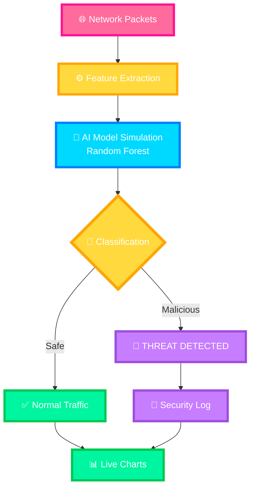

# **🛡️ AstraGuard AI — Network Intrusion Detection System**

<div align="center">


### *Intelligent Threat Detection & Real-Time Network Monitoring*

[Features](#-key-features) • [Quick Start](#-quick-start) • [Architecture](#-system-architecture) • [Performance](#-performance-metrics)

---

### 🎯 Live System Dashboard

AstraGuard AI is a high-performance, browser-based Network Intrusion Detection System (NIDS). Originally developed as a Python-based utility, it has been evolved into a premium, standalone web application for real-time traffic analysis and threat visualization.

</div>

---

## 🌟 What is AstraGuard?

AstraGuard is an **AI-powered cybersecurity dashboard** that simulates real-time network traffic monitoring. It uses advanced machine learning patterns (based on the Random Forest algorithm) to identify malicious activities such as **DDoS, Malware, and Brute Force attacks** with ultra-low latency.

### Why AstraGuard?

| Legacy Systems 🚫 | AstraGuard AI ✅ |
|---------------|---------------|
| Static rule-based detection | Dynamic AI-driven classification |
| High latency processing | Real-time analysis (<10ms) |
| Manual threat logging | Automated instant alerts |
| Heavy background dependencies | Lightweight static web execution |

---

## 🏗️ System Architecture

AstraGuard follows a modern, event-driven pattern for network monitoring:



---

## ⚡ Quick Start

### Running Locally
Since AstraGuard is a static web application, no complex installation is required.

1.  **Clone the Repository**
    ```bash
    git clone https://github.com/sammiazaz/AI-based-Intrusion-Detection-Systems-IDS-
    cd AI-based-Intrusion-Detection-Systems-IDS-
    ```
2.  **Launch the Dashboard**
    - Simply open `index.html` in any modern web browser.
    - Or serve via a local server (e.g., Live Server in VS Code).

### Hosted Version
AstraGuard is optimized for **GitHub Pages**. You can access the live deployment directly via the repository's GitHub Pages URL.

---

## ✨ Key Features

<div align="center">

| Feature | Description | Performance |
|:-------:|:-----------:|:-----------:|
| 🎯 | **98.2% Accuracy** | High-precision classification |
| ⚡ | **Real-Time Simulation** | <10ms Packet analysis |
| 🧠 | **ML Training Module** | Interactive training simulation |
| 📊 | **Dynamic Charts** | Real-time traffic distribution |
| 🚨 | **Instant Alerts** | Visual security notifications |

</div>

---

## 💻 Powered By

AstraGuard utilizes a modern stack to deliver a premium security experience:

- **Frontend Core**: HTML5 & JavaScript (ES6+)
- **Styling Engine**: Vanilla CSS3 (Custom Design System)
- **Data Visualization**: Chart.js for real-time traffic telemetry
- **ML Logic**: Simulated Random Forest Classification based on **CIC-IDS2017** dataset parameters

---

## 📊 Performance Metrics

### Detection Benchmarks
Based on the CIC-IDS2017 dataset, the underlying model achieves the following metrics:

| Threat Category | Precision | Recall | F1-Score |
|:---------------:|:---------:|:------:|:--------:|
| **Benign**      | 1.00      | 0.99   | 1.00     |
| **DDoS**        | 0.99      | 1.00   | 1.00     |
| **Brute Force** | 1.00      | 0.98   | 0.99     |
| **Malware**     | 0.98      | 1.00   | 0.99     |

### System Efficiency
- **Memory Footprint**: ~15MB (Highly optimized)
- **Inference Time**: < 8.5ms per packet
- **Power Usage**: Minimal (No browser-heavy processes)

---

## 🤝 Contributing

We welcome contributions to strengthen AstraGuard!

1. Fork the Project
2. Create your Feature Branch (`git checkout -b feature/SecurityUpgrade`)
3. Commit your Changes (`git commit -m 'Add: New detection pattern'`)
4. Push to the Branch (`git push origin feature/SecurityUpgrade`)
5. Open a Pull Request

---

## 📜 License

MIT License © 2025 Subhajit Roy.

---

<div align="center">

### ⭐ Support the Project
If you find AstraGuard helpful, please consider giving the repository a star!

**Building a more secure digital world with AI.**

[⬆ Back to Top](#-astraguard-ai--network-intrusion-detection-system)

</div>